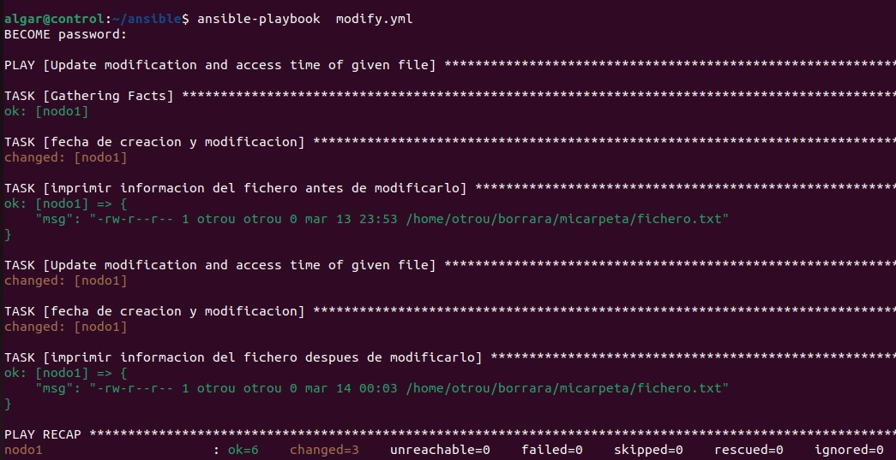

## Apuntes del bootcamp

Temas

1. Carpeta ssh para instrucciones de instalacion de ssh en ubuntu.<br><br>

2. Carpeta ansible para instrucciones de instalcion de ansible y su funcionamiento: <br><br>

3. 
Aquí está mi código:

```bash
- name: Update modification and access time of given file
  hosts: nodo1
  vars:
    ruta: /home/otrou/borrara/micarpeta/fichero.txt
  tasks:
    - name: fecha de creacion y modificacion
      shell: "ls -l {{ ruta }}"
      register: info_file1
    - name: imprimir informacion del fichero antes de modificarlo
      debug:
        msg: "{{ info_file1.stdout }}"
    - name: Update modification and access time of given file
      ansible.builtin.file:
        path: "{{ ruta }}"
        state: file
        modification_time: now
        access_time: now
    - name: fecha de creacion y modificacion
      shell: "ls -l {{ ruta }}"
      register: info_file2
    - name: imprimir informacion del fichero despues de modificarlo
      debug:
        msg: "{{ info_file2.stdout }}"
        
        
        
 
